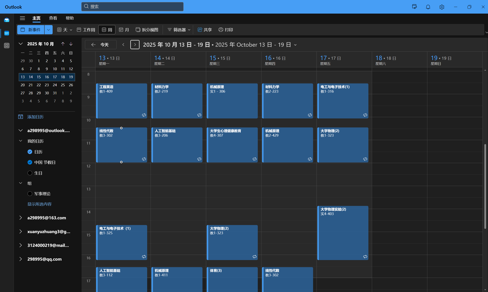
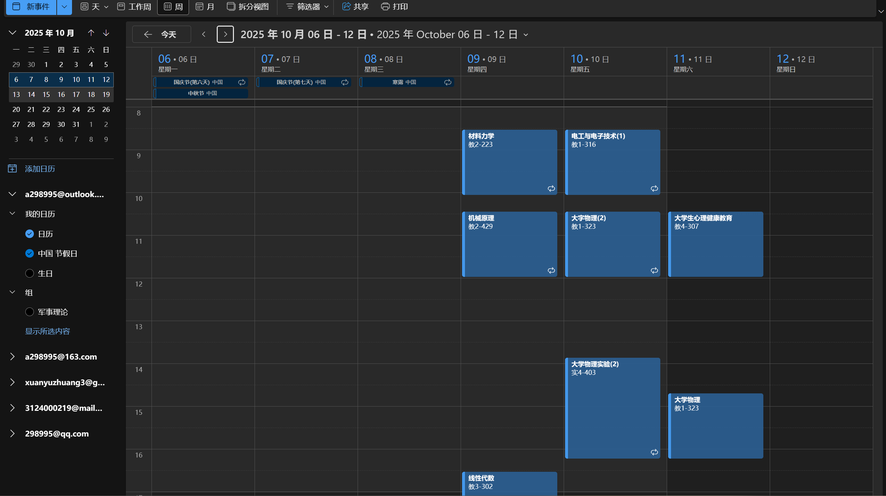
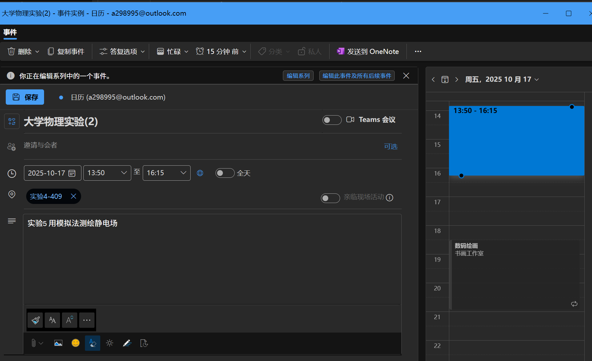
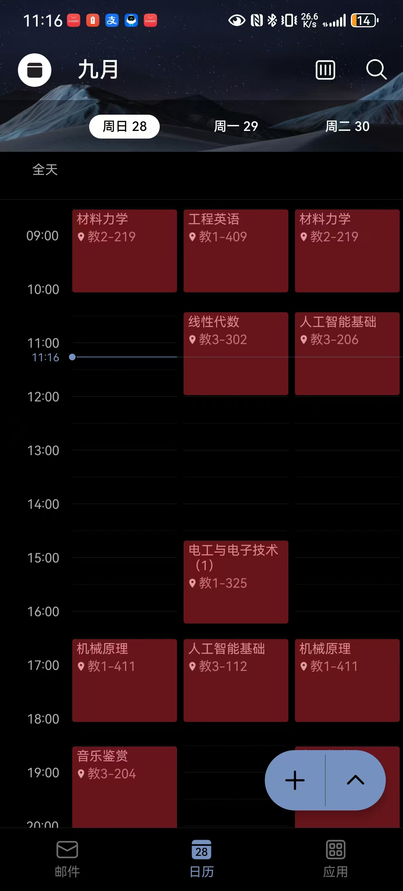
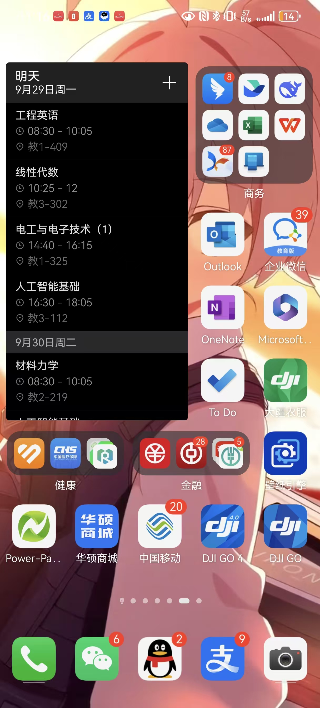
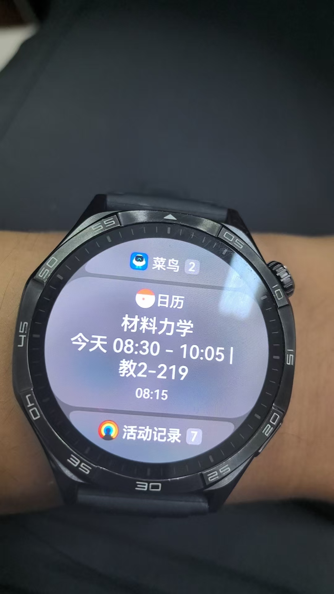

# GDUT Schedule Management Plug-in for Outlook

> 广东工业大学教务系统课程信息自动同步Outlook插件

## 📖 项目简介

本项目是一个专为广东工业大学学生设计的Outlook插件，能够自动从教务系统获取课程信息并同步到Outlook日历中，实现课程安排的智能化管理。

## ✨ 主要功能

- 🔄 **自动同步**：从GDUT教务系统自动拉取最新课程信息
- 📅 **日程管理**：将课程信息转换为Outlook日历事件
- 🔔 **智能提醒**：支持自定义上课提醒时间，支持设置可穿戴设备提醒
- 📱 **多平台同步**：支持Windows、Web、Android、iOS全平台同步
- ⚙️ **高度自定义**：支持个性化设置和事件描述

## 🚀 技术架构

### 核心流程

1. **数据获取**：从广东工业大学教务系统拉取课程信息（ICS格式）
2. **数据解析**：解析课程信息并转换为Outlook兼容的日程格式
3. **日历集成**：通过Outlook API将课程事件导入用户日历

### 技术栈

- Outlook API
- ICS文件解析
- 教务系统接口集成

## 🎯 项目优势

相比于现有的微信小程序GDUT_Days，本插件具有以下优势：

### 🎨 更强的自定义能力

- 基于Outlook原生界面，提供更丰富的自定义选项
- 支持个性化主题和布局设置

### 🔧 更完善的功能

- 与老师交流更加方便，依赖Outlook的联系人功能
- 利用Outlook完善的API生态
- 支持自定义提醒时间、事件描述、重复规则等高级功能
- 小组日程规划，ddl组员通知
- 日程移动 对于调休调课有着更加灵活的配置选择

### 🌐 真正的多平台同步

- **Windows**：原生桌面应用体验
- **Web**：通过网页版支持Linux等其他操作系统
- **移动端**：Android和iOS原生应用(HarmonyOS)
- **云同步**：基于Microsoft账户的全平台数据同步

### 📢 完善的通知系统

- 集成系统级通知权限
- 支持推送到智能手表等穿戴设备
- 多种提醒方式（邮件、弹窗、移动通知等）

## 计划实现的效果

